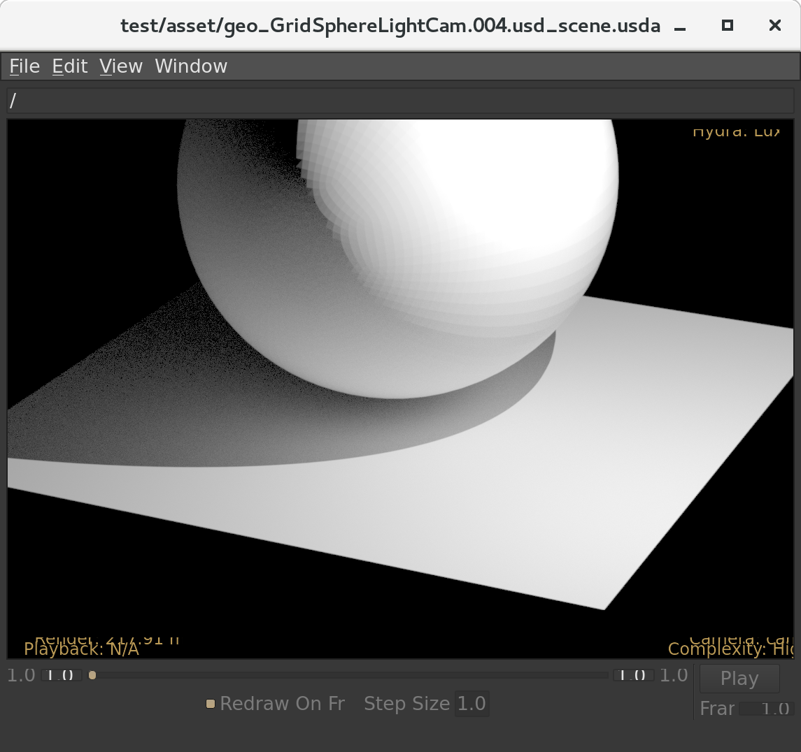

LuxCore USD Hydra delegate
===========================

This plugin allows fast GPU or CPU accelerated viewport rendering by the open source LuxCore rendererer for the USD and Hydra system

For more details on USD, please visit the web site [here](http://openusd.org).

Prerequisites
-----------------------------

#### Common
* **OpenGL 4.1. Note lower OpenGL versions can be used to build, but USD will not be able to run Hydra or this plugin without OpenGL 4.1+**
* **LuxCore SDK 2.2**
* **USD 19.07**
* **Windows 10 with Visual Studio 2017 or CentOS 7**
* **Cmake 3.16.0 or later**

#### How to Build For Windows 10
1. Download the USD release and build it into the folder C:\masters\USD
2. Download the LuxCore SDK and extract the zip into C:\masters\luxcorerender-v2.2-win64-opencl-sdk
3. From the root of this repo, run script\build_windows.bat
4. If the install proceeded correctly, you should now be able to run USDview and select LuxCore as your renderer
5. A test script is available in script/test.bat

#### How to Build for CentOS 7
1. Clone the USD repo with version tag v19.07 to ~/masters/USD-repo
2. Configure your CentOS 7 system by running script/centos7_preconfig.sh from this repo. If this is successful it should install system dependencies and build USD.
3. Download the LuxCore SDK and extract the archive to ~/masters/LuxCore-opencl-sdk
4. From the root of this repo, run script/build_linux.sh
5. If the install proceeded correctly, you should now be able to run USDview and select LuxCore as your renderer
6. A test script is available from this repo at script/test.sh
----
## Current Status
Currently the delegate will build against an existing USD installation and has all the necessary classes and methods to respond to the calls made by the hydra framework.  The delegate can render can currently render meshes and position the camera based on the USD scene description file.

## Credits
Thanks to Jereon Lapre of the California Academy of Sciences for the sample USDA file test/asset/geo_GridSphereLightCam.004.usd_scene.usda used for our rendering tests.
